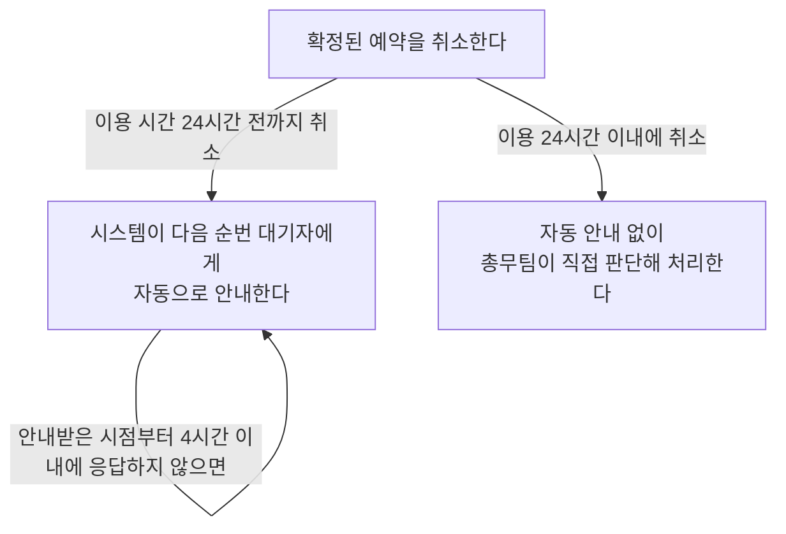

# 회의실 예약 취소 및 대기자 안내

예약이 확정된 이용자의 취소 시점에 따라 처리 방식이 달라진다.

```mermaid
flowchart TD
  A["확정된 예약을 취소한다"]
  A -->|"이용 시간 24시간 전까지 취소"| B["시스템이 다음 순번 대기자에게<br/>자동으로 안내한다"]
  A -->|"이용 24시간 이내에 취소"| C["자동 안내 없이<br/>총무팀이 직접 판단해 처리한다"]
  B -->|"안내받은 시점부터 4시간 이내에 응답하지 않으면"| B
```

- **대기자 응답:** 안내받은 시점부터 4시간 이내에 응답해야 한다.
- **응답 기한 경과:** 도식의 반복 화살표는 그다음 대기자에게 안내가 넘어감을 뜻한다.
- **남은 대기자가 없는 경우:** 해당 시간대가 일반 예약으로 다시 열린다.