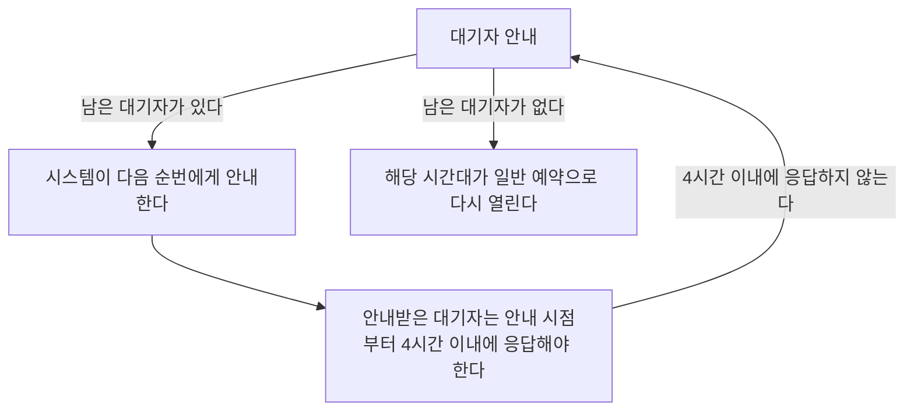

# 회의실 예약 취소 처리 안내

## 취소 시점별 처리

| 취소 시점 | 처리 방식 |
|---|---|
| 이용 시간 24시간 전까지 | 시스템이 대기자 명단의 다음 순번에게 자동으로 안내한다. |
| 이용 24시간 이내 | 자동 안내를 보내지 않는다. 총무팀이 직접 판단해 처리한다. |

## 대기자 안내 흐름

```mermaid
flowchart TD
    A["대기자 안내"] -->|"남은 대기자가 있다"| B["시스템이 다음 순번에게 안내한다"]
    A -->|"남은 대기자가 없다"| E["해당 시간대가 일반 예약으로 다시 열린다"]
    B --> C["안내받은 대기자는 안내 시점부터 4시간 이내에 응답해야 한다"]
    C -->|"4시간 이내에 응답하지 않는다"| A
```