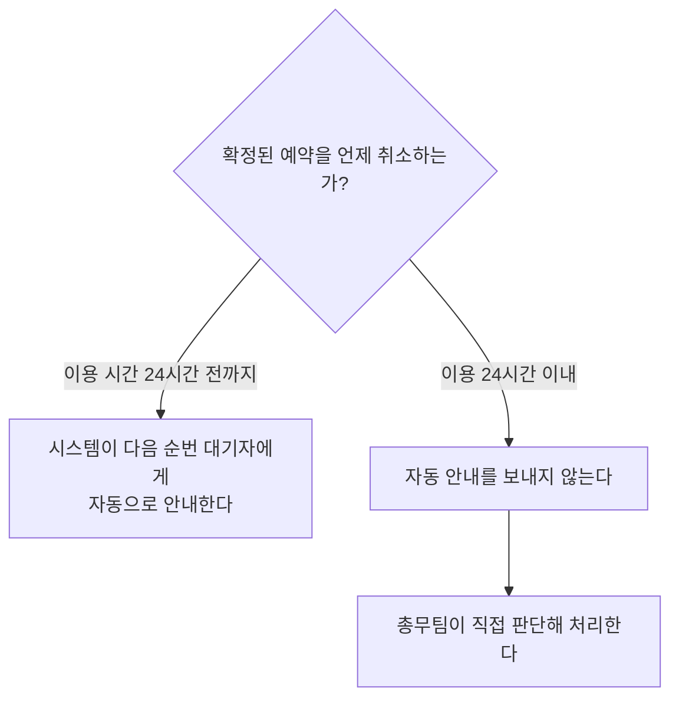

# 회의실 예약 취소와 대기자 안내

## 취소 시점에 따른 처리

```mermaid
flowchart TD
  A{"확정된 예약을 언제 취소하는가?"}
  A -->|"이용 시간 24시간 전까지"| B["시스템이 다음 순번 대기자에게<br/>자동으로 안내한다"]
  A -->|"이용 24시간 이내"| C["자동 안내를 보내지 않는다"]
  C --> D["총무팀이 직접 판단해 처리한다"]
```

## 대기자 응답과 예약 재개

- **대기자 응답:** 안내받은 대기자는 안내받은 시점부터 4시간 이내에 응답해야 한다.
- **기한 내 미응답:** 그다음 대기자에게 안내가 넘어간다.
- **남은 대기자가 없을 때:** 해당 시간대를 일반 예약으로 다시 연다.